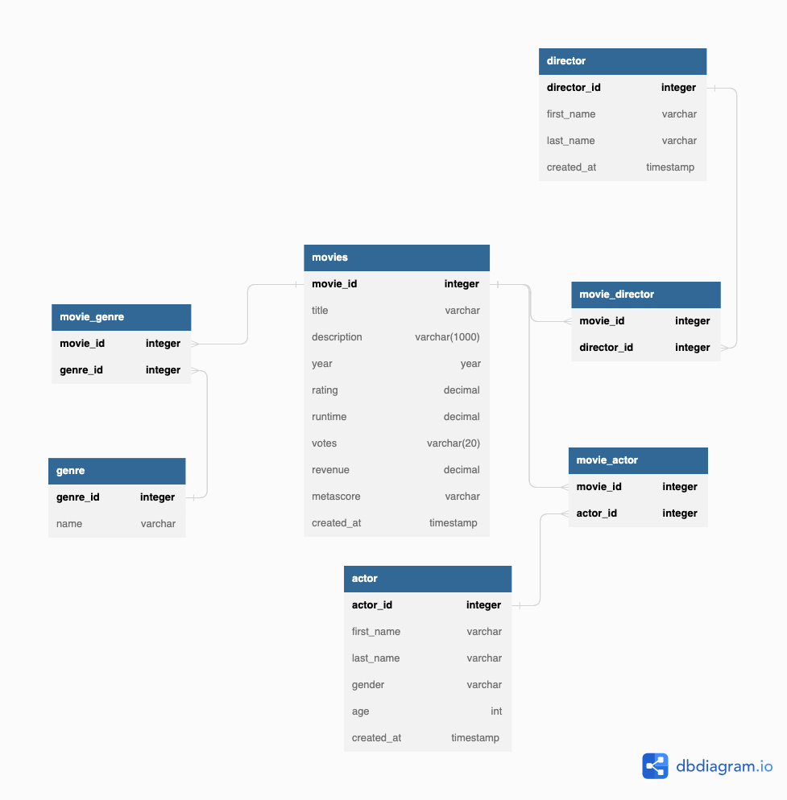

## movies
*By: Jeet Soni*

*Date: 06/15/2023*
_______
### **Description**
I told y'all to stay tuned for more in my last project. Well, I'm here with one more. I was definetely less fustrated than last time. As I do more of this "chopping", it's starting to come to me naturally as I look at the flat file. I still struggled a little bit but it was fun. Fun fact: I love writing in markdown now.
### **Data**
| id | title | genre | description | director | actors | year | runtime   | rating  | votes | revenue | metascore | 
|---|---|---|---|---|---|---|---|---|---|---|---|
| 1 | Guardian of the galaxy | action,adventure,Sci-Fi  | A group of intergalactic criminals are forced to work together to stop a fanatical warrior from taking control of the universe  |James Gunn |Chris Pratt, Vin Diesel, Bradley Cooper, Zoe Saldana| 2014  |121   | 8.1  | 757074 | 333.13  | 76  | 
| 2 | Prometheus  | Adventure,Mystery,Sci-Fi  | Following clues to the origin of mankind, a team finds a structure on a distant moon, but they soon realize they are not alone.  | Ridley Scott  | Noomi Rapace, Logan Marshall-Green, Michael Fassbender, Charlize Theron  |  2012 | 124 | 7  | 485820  | 126.46 | 65|
| 3 | Split  | Horror,Thriller  | Three girls are kidnapped by a man with a diagnosed 23 distinct personalities. They must try to escape before the apparent emergence of a frightful new 24th.  |  M. Night Shyamalan | James McAvoy, Anya Taylor-Joy, Haley Lu Richardson, Jessica Sula  |  2016 | 117  | 7.3  | 157606  | 138.12  | 62  |

### **ER Diagram**

### **Conclusion**

This is my ER-diagram based on the sample data. I will be adding more attributes and entities in future to make it a solid design. I enjoyed designing this and you already know there are more coming!

Stay tuned for more :)

